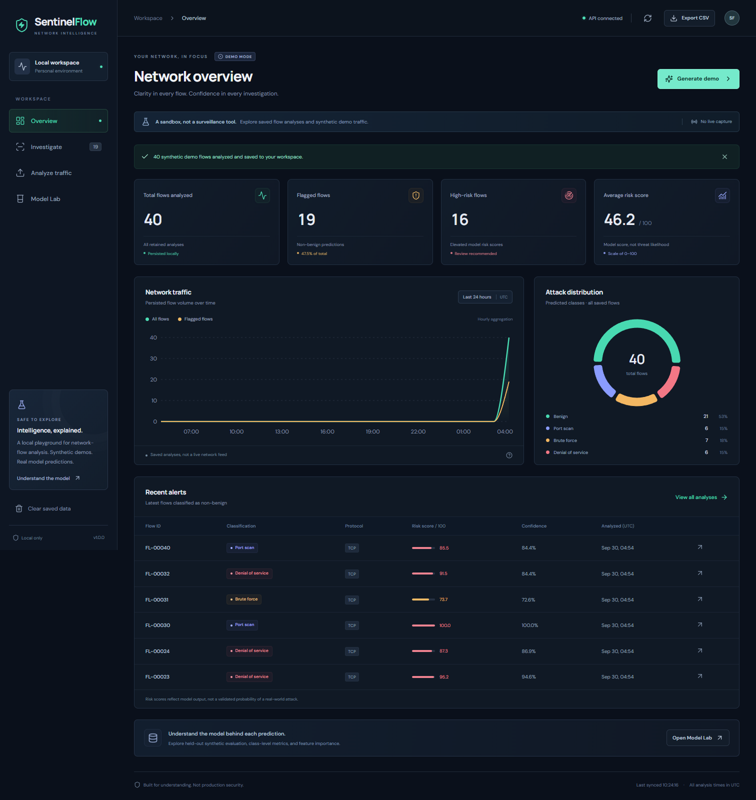

# SentinelFlow

**An explainable network-flow classification dashboard for a final-year project.** Submit flow summaries, import a CSV, or generate a synthetic demo batch; explore predictions, model sensitivities, and saved analysis history in a React interface backed by FastAPI and SQLite.

> **Educational and local-only.** There is no authentication. SentinelFlow does not capture packets, monitor a network interface, block traffic, or detect attacks in real time. It analyzes only the flow records you explicitly submit or generate. Do not expose its API or development servers to a public network.

<details>
<summary><strong>See the working dashboard</strong> — actual synthetic-demo screenshot</summary>



[View the mobile layout](docs/images/dashboard-mobile.png). Captured from the running application, not a mockup; all displayed records are synthetic.

</details>

## Quick start

Prerequisites: **Python 3.11+**, **Node.js 22 LTS** with npm, and an internet connection for the initial dependency installation. Run commands from the project root. No virtual-environment activation is needed.

**Windows PowerShell**

```powershell
py -3.11 scripts/dev.py --install
py -3.11 scripts/dev.py
```

**macOS / Linux**

```bash
python3 scripts/dev.py --install
python3 scripts/dev.py
```

If your Python 3.11+ executable is named `python`, use `python scripts/dev.py --install`, then `python scripts/dev.py` on either platform. On Linux, install your distribution's Python venv package if virtual-environment creation fails.

Open **http://127.0.0.1:5173** after both servers are ready. The API is at **http://127.0.0.1:8000**, with interactive documentation at **/docs** and a health check at **/health**. Press **Ctrl+C** in the launcher terminal to stop both process trees.

The installer creates `.venv`, installs `backend/requirements-dev.txt`, and runs `npm ci` in `frontend`. Stop running development servers before reinstalling; on Windows, a running Vite process can lock npm's native build tools. The launcher always uses that virtual environment; it also handles the Windows `npm.cmd` shim. Development traffic to `/api` and `/health` is proxied by Vite to FastAPI. Ports 8000 and 5173 must be available; the launcher does not silently choose another Vite port.

## Try the workflow

1. Generate a synthetic demo batch to populate the dashboard. Repeating this action **appends** records; it does not reset the database.
2. Review the class distribution, risk summary, and recent analyses. The timeline groups saved records by UTC hour, rather than representing captured live traffic.
3. Inspect a prediction's class probabilities and feature explanations. Change a field in a manual submission and compare the outcome.
4. Import [`data/sample_flows.csv`](data/sample_flows.csv): 12 illustrative, manually authored flow records. Its optional `label` column is ignored during inference and is **not** an evaluation benchmark or a guarantee of the predicted class.
5. Inspect the model report for computed held-out metrics and the confusion matrix, then export saved analyses as CSV.
6. Clear analysis history only when needed; the interface requests confirmation. This removes saved records, not the model's training data.

### Features

- Four predicted classes: `benign`, `port_scan`, `brute_force`, and `dos`.
- Validated manual/batch submission and atomic CSV import: an invalid row rejects the whole import.
- SQLite persistence, paginated/filtered history, summary statistics, and CSV export.
- Per-class probabilities, a risk score, and up to four positive feature-ablation explanations.
- A deterministic Random Forest model report with accuracy, macro-F1, per-class precision/recall/F1, feature importance, and a confusion matrix.
- Synthetic demonstration data; **no hidden collection, packet sniffing, or external threat feed**.

## How it works

```text
Manual flow / uploaded CSV / seeded demo
                    |
                    v
React + TypeScript (Vite) --> FastAPI validation --> Random Forest
                                      |                  |
                                      |      probabilities + ablations
                                      v                  v
                                   SQLite <--------- saved analysis
                                      |
                              dashboard / history / export
```

In development, Vite serves the UI on loopback port 5173 and proxies requests to FastAPI on loopback port 8000. After `npm run build`, FastAPI serves `frontend/dist` when present; a container therefore needs only port 8000. The backend ASGI entry point is `backend.app.main:app`.

```text
backend/app/             FastAPI application, model, and persistence
backend/tests/           Backend tests
frontend/                React/TypeScript UI and frontend tests
docs/API_CONTRACT.md     Request/response definitions and limits
docs/PROJECT_GUIDE.md    Objectives, evaluation, and presentation guide
data/sample_flows.csv    Small illustrative CSV import
scripts/dev.py           Cross-platform installer and development launcher
Dockerfile               Multi-stage frontend build + non-root Python runtime
compose.yaml             Loopback-only container service and SQLite volume
```

### Model and interpretation

The Random Forest is trained deterministically on **3,000 seeded synthetic flows**: **2,400 training examples** and **600 held-out examples**, with seed 42. Metrics are actually computed on that held-out split; no score is promised here. See the in-app model report or `GET /api/model` for the current results.

- **Predicted label:** class with the largest predicted probability.
- **Confidence:** probability of that predicted class (0–1).
- **Flagged:** predicted label is not benign. **High risk:** risk score is at least 80/100; this display threshold is not tuned against real traffic.
- **Risk score:** `(1 - P(benign)) × 100` (0–100). This is a model score, **not a calibrated probability of a real attack**. Confidence and risk are different quantities.
- **Explanation impact:** percentage-point decrease in risk after replacing one feature with its benign-training median (numeric) or mode (protocol), leaving other inputs fixed. At most four positive effects are returned. These are **model sensitivities, not causal explanations or SHAP values**; effects need not sum to the risk score. No positive effect may be found for some flows.
- **Confusion matrix:** rows are actual labels, columns are predicted labels, in the model report's `labels` order.

Because training and testing use the same synthetic generator, strong held-out performance primarily demonstrates recovery of that generator's patterns. It does **not** establish generalization to real networks.

To reproduce the experiment without starting the web app, run your virtual-environment Python with `-m backend.app.evaluate --output reports/evaluation.json`. The [saved report](reports/evaluation.json) includes a majority-class baseline and runtime versions. See the [data dictionary and experiment protocol](docs/DATASET.md) for feature definitions and leakage precautions. Rows are enriched traffic-window summaries; failed logins require application-log enrichment, not packet capture alone.

## API and CSV format

See the complete [`API contract`](docs/API_CONTRACT.md) and running `/docs` for all schemas, validation bounds, and errors.

| Endpoint | Purpose |
| --- | --- |
| `GET /health` | Health/version check, outside `/api` |
| `GET /api/overview` | Saved-flow totals, distribution, timeline, recent alerts |
| `POST /api/analyze` | Analyze and save 1–500 flow summaries |
| `POST /api/demo` | Generate and save 1–100 synthetic examples |
| `POST /api/import` | Import UTF-8 CSV, at most 2 MiB and 500 rows |
| `GET /api/analyses` | Paginated history, optionally filtered by predicted label |
| `GET /api/analyses/{id}` | One saved analysis |
| `GET /api/export` | Export the latest at most 10,000 saved analyses |
| `GET /api/model` | Model details and computed evaluation metrics |
| `DELETE /api/analyses` | Delete all saved analyses |

Required CSV headers (any order):

```csv
duration_ms,packets,bytes_transferred,src_port,dst_port,failed_logins,unique_dest_ports,syn_ratio,protocol
```

All nine flow fields are required. Protocol must be `TCP`, `UDP`, or `ICMP`; unknown columns are rejected except for the optional ignored `label` column. JSON flow objects do not accept `label`. The analysis export also contains identifiers and predictions, so it is **not directly re-importable** without selecting the input feature columns.

## Configuration and local data

| Variable | Default | Meaning |
| --- | --- | --- |
| `SENTINEL_DB_PATH` | `backend/data/sentinel.db` | SQLite file path; use a writable location |
| `SENTINEL_CORS_ORIGINS` | Backend's local-development defaults | Comma-separated browser origins; no wildcard needed |

The launcher inherits environment variables from your shell; it does **not** load a `.env` file automatically. Example overrides before launching:

```powershell
# PowerShell
$env:SENTINEL_DB_PATH = "E:/SentinelData/sentinel.db"
$env:SENTINEL_CORS_ORIGINS = "http://127.0.0.1:5173,http://localhost:5173"
```

```bash
# macOS / Linux
export SENTINEL_DB_PATH="$HOME/sentinel-data/sentinel.db"
export SENTINEL_CORS_ORIGINS="http://127.0.0.1:5173,http://localhost:5173"
```

Use only permitted local data. Saved feature records remain on disk until cleared. Database files, `.env` files, private keys, and agent workspace directories are excluded from source control and the Docker build context. Ignore rules are not a substitute for checking files before sharing them. CORS is **not authentication** and does not prevent non-browser clients from using the API.

## Docker: one local service

With Docker Engine / Docker Desktop and Compose installed:

```bash
docker compose up --build
```

Open **http://127.0.0.1:8000**. The image builds the frontend in a Node stage, installs runtime Python dependencies, then runs FastAPI as a **non-root user (UID/GID 10001)**. A Python-based `/health` check is included. The container listens on all its internal interfaces, but Compose publishes **only `127.0.0.1:8000`** on the host. Do not change that to a public binding for this unauthenticated app.

SQLite is stored at `/data/sentinel.db` on the named `sentinel-data` volume. `docker compose down` removes containers but preserves this volume. **`docker compose down --volumes` permanently deletes its saved analyses.** If replacing the named volume with a host bind mount, make its directory writable by UID/GID 10001. Initial model preparation may take a moment; view logs with `docker compose logs -f` and health status with `docker compose ps`.

The Docker instructions package the local demonstration, not a hardened internet-facing service.

## Tests and build

After installing dependencies:

**Windows PowerShell**

```powershell
.\.venv\Scripts\python.exe -m pytest backend/tests
Set-Location frontend
npm.cmd run test
npm.cmd run build
Set-Location ..
```

**macOS / Linux**

```bash
.venv/bin/python -m pytest backend/tests
(cd frontend && npm run test && npm run build)
```

GitHub Actions runs backend lint/format/tests with a 95% coverage floor, frontend tests/build, and a real-API headless Chromium smoke check using Python 3.11 and Node.js 22. The browser check uses an isolated temporary database. See [the verification guide](docs/TESTING.md) for coverage, browser checks, and dependency audits.

To try the built UI without Vite, run the frontend build and start only FastAPI from the repository root:

```powershell
# Windows PowerShell
.\.venv\Scripts\python.exe -m uvicorn backend.app.main:app --host 127.0.0.1 --port 8000
```

```bash
# macOS / Linux
.venv/bin/python -m uvicorn backend.app.main:app --host 127.0.0.1 --port 8000
```

Then use http://127.0.0.1:8000. Stop the development launcher first to free port 8000.

## Limitations and responsible use

- Synthetic training/testing only; no real-network benchmark, operational security guarantee, or production-grade intrusion-detection claim.
- No packet capture, real-time stream ingestion, automatic mitigation, or identity management. An overview refresh is not network monitoring.
- No authentication, authorization, TLS termination, multi-tenant isolation, or production availability guarantees. Treat all write/delete endpoints as accessible to local clients.
- A four-class closed-set classifier cannot reliably recognize unknown attacks, dataset shift, or adversarial manipulation.
- Synthetic probabilities are not calibrated real-world risks; false positives and false negatives require human review. Ablations can create unrealistic feature combinations.
- SQLite and the current batch limits suit a local demonstration, not high-volume production ingestion. No automatic retention/backup policy is provided.
- Do not upload sensitive organizational traffic without authorization. Collecting or labeling future real traffic requires consent, data minimization, and a separate ethical evaluation.

For project objectives, an honest evaluation protocol, a presentation walkthrough, and a real-dataset extension plan, read [`docs/PROJECT_GUIDE.md`](docs/PROJECT_GUIDE.md).
